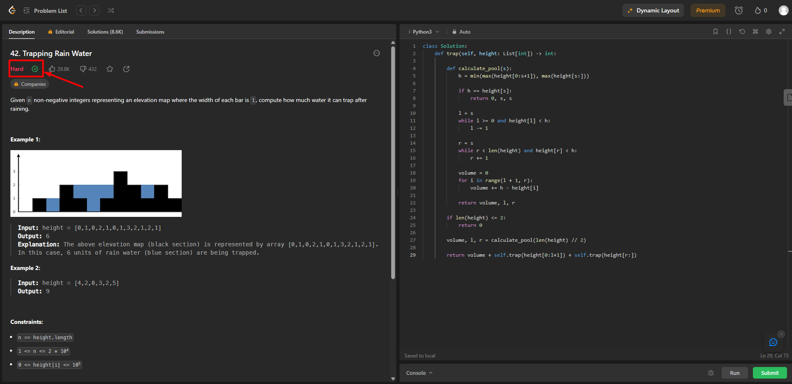
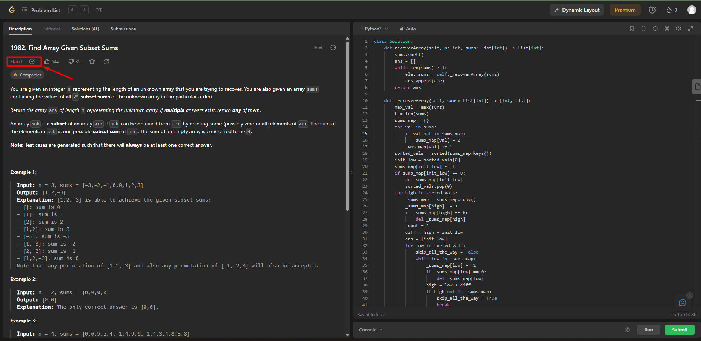
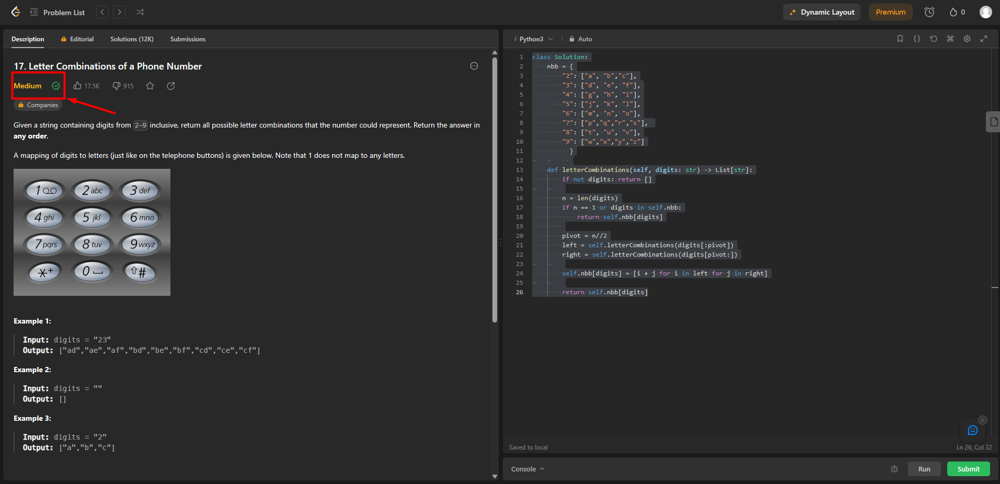

# Dividir e Conquistar no LeetCode

**Número da Lista**: 4 
**Conteúdo da Disciplina**: Dividir e Conquistar 

## Alunos
|Matrícula | Aluno |
| -- | -- |
| 21/1029559 | Rafael Brito Bosi Rodrigues |

## Sobre 

Este repositório tem como objetivo compilar a resolução de alguns problemas encontrados na plataforma [LeetCode](https://leetcode.com/), tais problemas estão dentro do escopo do conteúde abrangido por DC (Algoritmos de Dividir e Conquistar).

Exercícios Solucionados:

- [42 - Trapping Rain Water](https://leetcode.com/problems/trapping-rain-water/description/) | **Difícil**
- [1982 - Find Array Given Subset Sums](https://leetcode.com/problems/find-array-given-subset-sums/description/) | **Difícil**
- [17 - Letter Combinations of a Phone Number](https://leetcode.com/problems/letter-combinations-of-a-phone-number/description/) | **Média**

## Screenshots

Seguem aqui os screenshots das questões solucionadas, a seta de cada print serve apenas para apontar para o indicador que demonstra que o problema foi resolvido com sucesso.

Importante ressaltar que todos os exercícios usam o rpincípio de algoritmos de "Dividir e Conquistar", separando o problema em subproblemas e depois juntando os pedaços já resolvidos, para então dar a resposta final.

### 42 - Trapping Rain Water

Para ver a solução dessa questão clicar [aqui](./exercicios/42.py).

### 1982 - Find Array Given Subset Sums

Para ver a solução dessa questão clicar [aqui](./exercicios/1982.py).

### 17 - Letter Combinations of a Phone Number

Para ver a solução dessa questão clicar [aqui](./exercicios/17.py).

## Instalação 
**Linguagem**: Python 3 

Como o LeetCode é uma plataforma online que roda na web, não é necessário baixar nenhum tipo de dependência.

## Uso 

Para testar as soluções aqui propostas basta ir até o arquivo de ["exercicios"](./exercicios/), copiar o código da questão desejada, navegar até o link da questão que pretende testar e subimeter o código ao juiz online.

Importante ressaltar que é necessário selecionar a linguagem "Python3" na plataforma, caso contrário, o código não irá funcionar.

## Outros 

Para acessar o vídeo onde os códigos e algoritmos são explicados e detalhados, basta clicar [aqui](./video/Entrega%204%20-%20Dividir%20e%20Conquistar.mp4).

OBS: O arquivo de vídeo esta com a extensão .mp4, o que torna necessário o download do arquivo para assistir ao vídeo.

